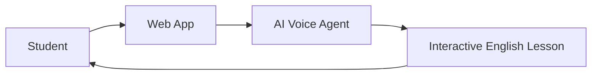

# AI-in-Education Platform - Level 1: Executive Summary

## Overview

AI-in-Education is an intelligent English language learning platform that combines modern web technologies with AI-powered voice agents to deliver interactive, personalized 1-on-1 English lessons.

## Core Concept



## What It Does

- **Interactive English Lessons**: Students engage in real-time voice conversations with an AI teacher
- **Structured Curriculum**: Courses organized by topics with multiple difficulty levels
- **Real-time Feedback**: AI-powered speech recognition and natural language processing
- **Progress Tracking**: Monitor learning progress through courses and lessons

## Key Benefits

1. **Personalized Learning**: 1-on-1 interaction adapts to student pace
2. **24/7 Availability**: AI teacher available anytime
3. **Structured Content**: Professional curriculum with clear learning objectives
4. **Multi-skill Development**: Speaking, listening, reading, and writing practice

## Technology Stack

- **Frontend**: Next.js 15 + React 19 + TypeScript
- **Backend**: FastAPI (Python 3.12+)
- **Voice AI**: LiveKit Agents with STT/LLM/TTS pipeline
- **Real-time Communication**: WebRTC via LiveKit

## Architecture Snapshot

```
┌─────────────────┐
│   Web Browser   │
│   (Next.js)     │
└────────┬────────┘
         │
    ┌────▼─────┐
    │ LiveKit  │ ◄── Real-time Voice
    │  Server  │
    └────┬─────┘
         │
    ┌────▼─────┐
    │   AI     │
    │  Agent   │
    └──────────┘
```

## Business Value

- Reduces cost of 1-on-1 tutoring
- Scales to unlimited students simultaneously
- Provides consistent, high-quality instruction
- Enables remote learning from anywhere

## Target Users

- English language learners
- Educational institutions
- Corporate training programs
- Self-directed learners
