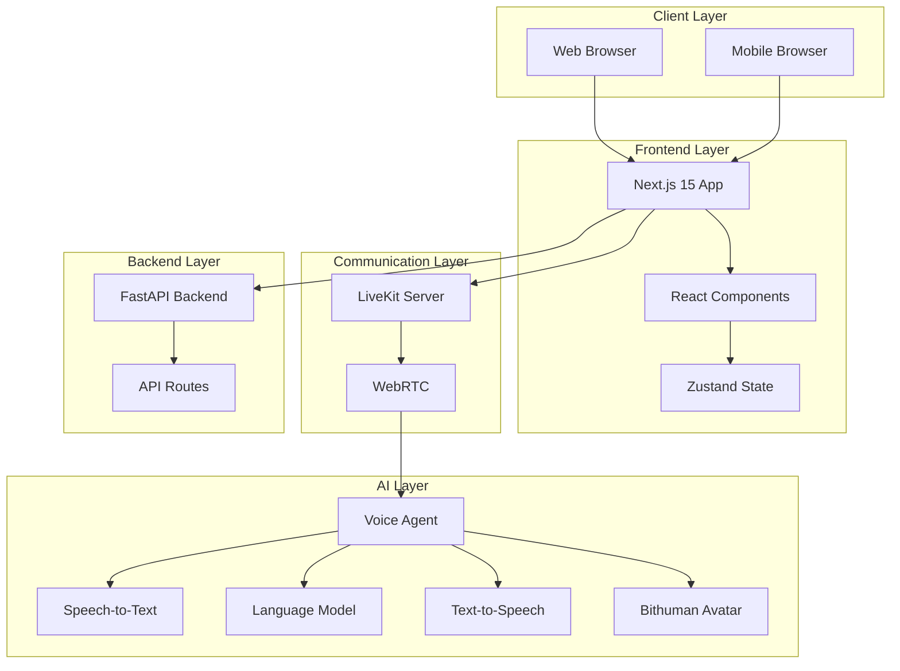
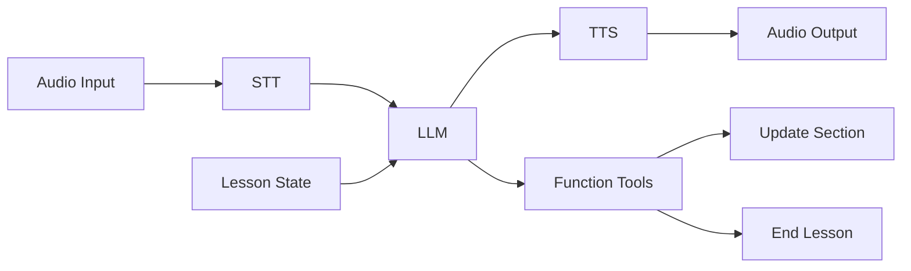
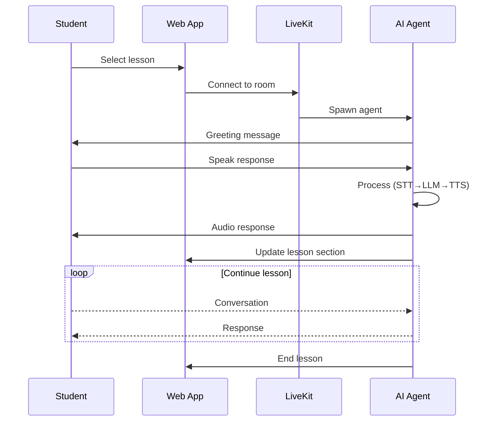
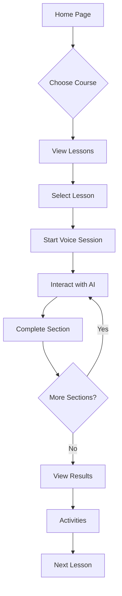
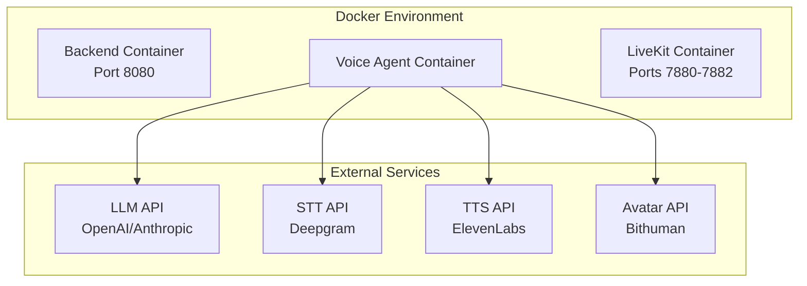

# AI-in-Education Platform - Level 2: Architecture Overview

## System Architecture



## Core Components

### 1. Frontend (Next.js 15)

**Purpose**: Web application for students to browse courses, start lessons, and interact with AI teacher

**Key Features**:
- Server-side rendering for fast page loads
- Internationalization (i18n) with next-intl
- Responsive design with TailwindCSS
- Component library using shadcn/ui

**Pages Structure**:
```
/                    → Course catalog
/lessons/[slug]      → Course lessons list
/lesson/[id]         → Individual lesson page
/topic/[id]          → Topic details
/activity/[id]       → Learning activities
/result/[id]         → Lesson results
/avatars/[id]        → Avatar selection
/conversation        → Voice conversation UI
```

### 2. LiveKit Server

**Purpose**: Real-time audio/video communication infrastructure

**Responsibilities**:
- WebRTC signaling
- Media routing
- Room management
- Participant coordination

**Ports**:
- 7880: HTTP API
- 7881: WebSocket
- 7882: UDP (media)

### 3. Voice Agent (LiveKit Agents)

**Purpose**: AI-powered conversational agent that conducts English lessons

**Components**:



**Agent Capabilities**:
- Speech recognition (STT)
- Natural language understanding (LLM)
- Speech synthesis (TTS)
- Lesson state management
- Interactive tools

### 4. Backend (FastAPI)

**Purpose**: API server for data management and business logic

**Current State**: Minimal implementation
- Health check endpoints
- CORS configured
- Ready for expansion

## Data Flow

### Lesson Session Flow



### Course Navigation Flow



## Deployment Architecture



## Technology Decisions

### Why Next.js 15?
- Server components for performance
- Built-in routing and i18n
- React 19 support
- Excellent developer experience

### Why LiveKit?
- Production-ready WebRTC
- Built-in agent framework
- Scalable architecture
- Real-time media handling

### Why FastAPI?
- Fast async Python
- Automatic API documentation
- Type safety with Pydantic
- Easy to extend

### Why LiveKit Agents?
- Purpose-built for voice AI
- Integrated STT/LLM/TTS pipeline
- Function calling support
- Session management

## Scalability Considerations

**Horizontal Scaling**:
- Multiple agent workers
- Load balancing via LiveKit
- Stateless frontend

**Vertical Scaling**:
- GPU acceleration for AI models
- Increased container resources
- Database optimization (future)

## Security Measures

- HTTPS for all communications
- API key authentication
- CORS configuration
- Environment variable management
- Secure token generation for LiveKit
