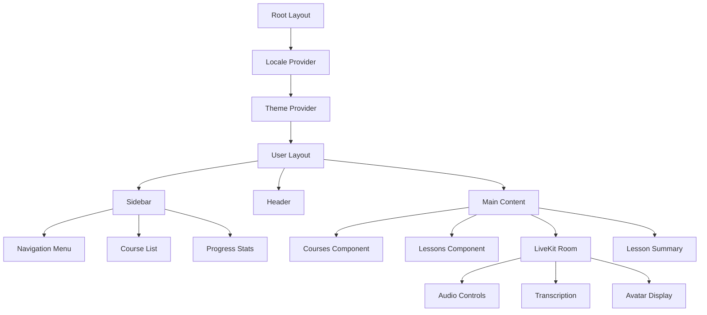
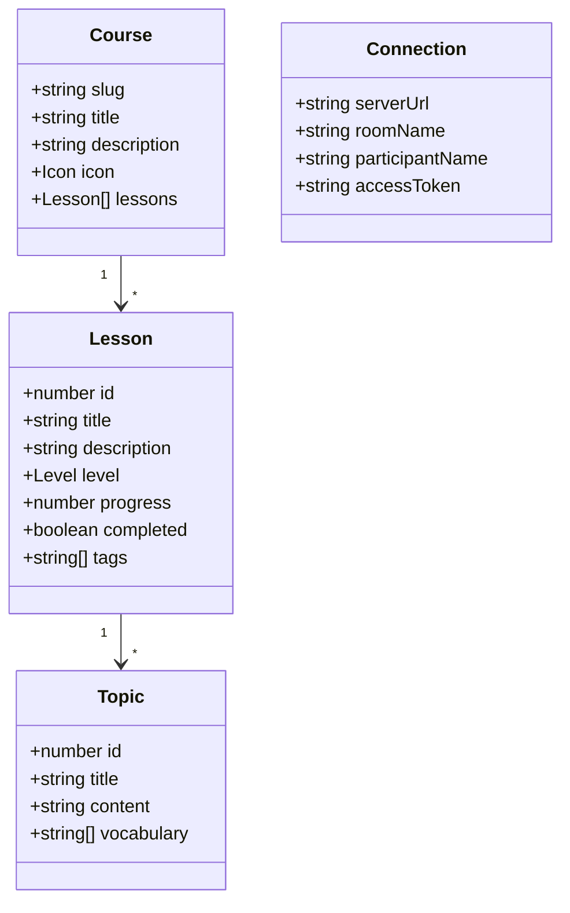
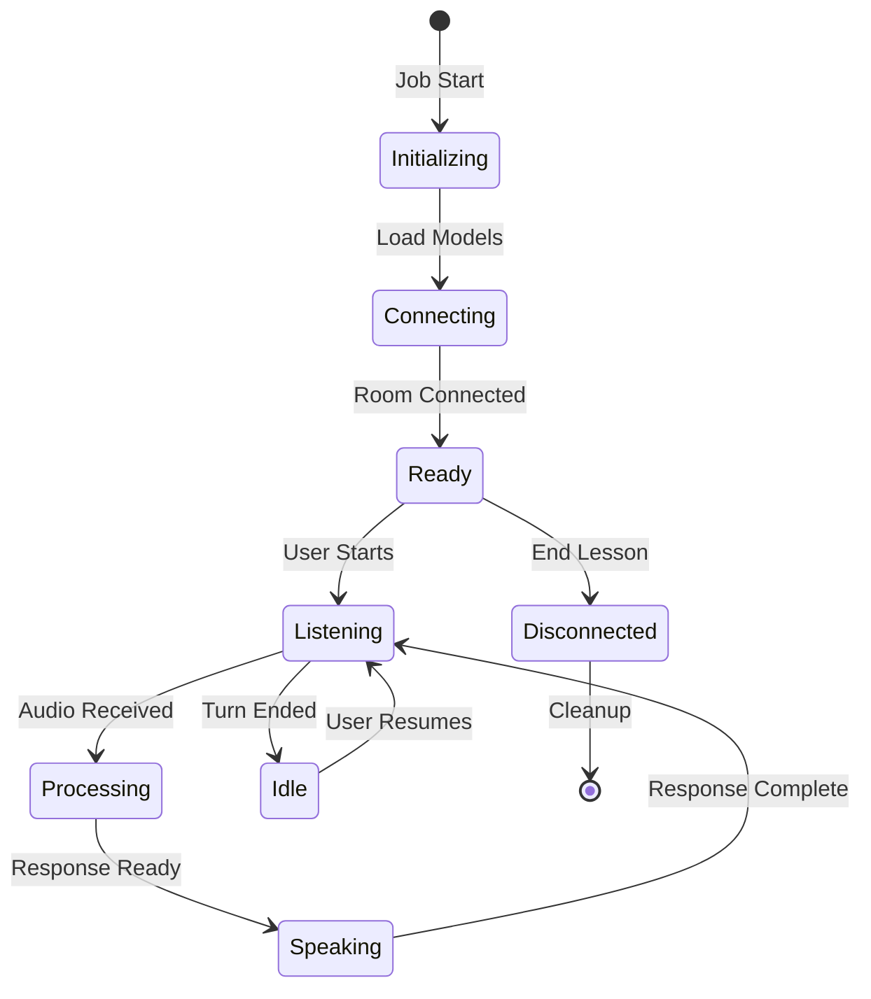
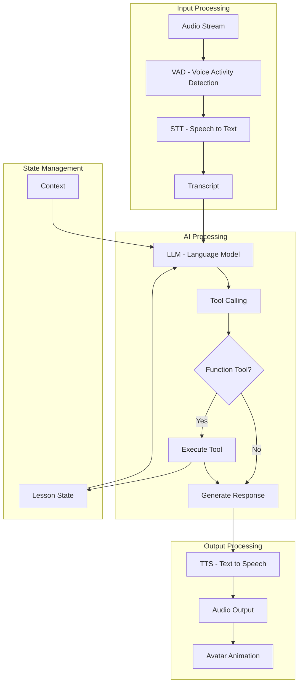
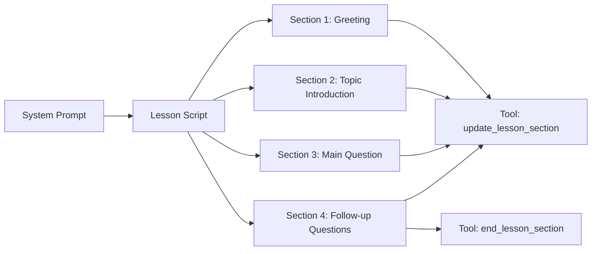
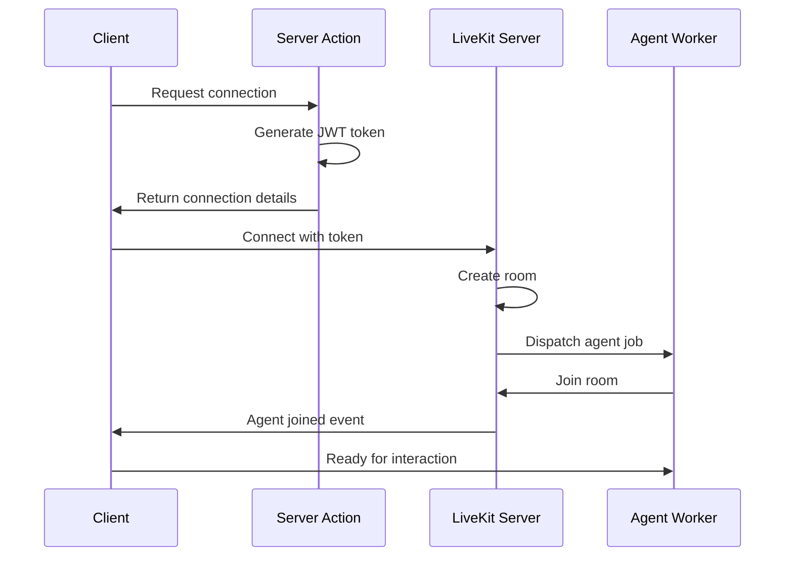
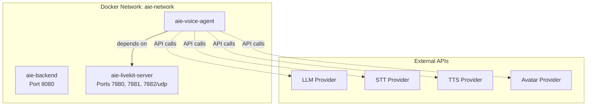

# AI-in-Education Platform - Level 3: Technical Deep Dive

## Application Structure

### Directory Layout

```
ai-in-education/
├── front-end/              # Next.js 15 application
│   ├── app/
│   │   ├── [locale]/      # Internationalized routes
│   │   │   ├── (user)/    # User-facing pages
│   │   │   └── api/       # API routes
│   │   └── globals.css    # Global styles
│   ├── components/        # React components
│   │   └── ui/           # shadcn/ui components
│   ├── lib/              # Utilities
│   ├── hooks/            # Custom hooks
│   ├── store/            # Zustand stores
│   ├── actions/          # Server actions
│   ├── types/            # TypeScript types
│   └── enum/             # Enums
│
├── backend/              # FastAPI application
│   ├── main.py          # Application entry
│   ├── routes/          # API routes
│   ├── data/            # Data storage
│   └── settings.py      # Configuration
│
├── voice-agents/        # LiveKit agents
│   ├── main.py         # Agent worker
│   ├── agent.py        # Agent logic
│   ├── models.py       # AI model initialization
│   ├── settings.py     # Configuration
│   └── prompt/         # Agent prompts
│       └── system_v2.py
│
└── docker-compose.yaml  # Service orchestration
```

## Frontend Architecture

### App Router Structure

```mermaid
graph TB
    subgraph "Root Layout"
        A[layout.tsx]
    end
    
    subgraph "Locale Route /[locale]"
        B[layout.tsx - i18n provider]
        
        subgraph "User Group /(user)"
            C[layout.tsx - sidebar]
            D[page.tsx - Home]
            E[lessons/ - Course list]
            F[lesson/[id]/ - Lesson detail]
            G[conversation/ - Voice UI]
            H[topic/[id]/ - Topics]
            I[activity/[id]/ - Activities]
            J[result/[id]/ - Results]
            K[avatars/[id]/ - Avatar picker]
        end
    end
    
    subgraph "API Routes /api"
        L[connection-details/]
        M[change-language/]
    end
    
    A --> B
    B --> C
    C --> D
    C --> E
    C --> F
    C --> G
    C --> H
    C --> I
    C --> J
    C --> K
    B --> L
    B --> M
```

### Component Hierarchy



### State Management

**Zustand Store**:
```typescript
// Global state structure
interface AppState {
  user: UserState
  course: CourseState
  lesson: LessonState
  connection: ConnectionState
}
```

**Server Actions**:
- `getCourses()` - Fetch course catalog
- `getLessonById(id)` - Get lesson details
- `getTopics()` - Retrieve topic list

### Type System



## Voice Agent Architecture

### Agent Session Lifecycle



### Agent Pipeline



### Function Tools

**1. update_lesson_section**:
```python
Purpose: Notify frontend of lesson section changes
Parameters: section_name (str)
Valid values: ["Introduction", "Main Activities", "Conclusion"]
Action: Sends RPC to client with section update
```

**2. end_lesson_section**:
```python
Purpose: Signal lesson completion
Parameters: None
Action: Sends RPC to client with end signal
```

### Agent Prompt Structure



## LiveKit Integration

### Room Management



### RPC Communication

**Client → Agent**:
- `start_turn` - Begin listening to user
- `end_turn` - Stop listening, process input
- `cancel_turn` - Discard current input

**Agent → Client**:
- `client.update_lesson_state` - Update UI state
  ```json
  {
    "type": "section_change" | "section_end",
    "value": "section_name" | "true"
  }
  ```

### Audio Configuration

```yaml
Input:
  - Audio num channels: 1 (mono)
  - Video: Disabled
  - Noise cancellation: Optional
  
Output:
  - Sync transcription: Enabled
  - Audio format: Opus
  - Sample rate: 48000 Hz
```

## Backend API

### Endpoints

**GET /** - Root health check
```json
Response: {
  "message": "Ready",
  "status": "healthy"
}
```

**GET /health** - Detailed health check
```json
Response: {
  "status": "healthy",
  "service": "backend"
}
```

**GET /api/connection-details** - LiveKit connection info
```json
Response: {
  "serverUrl": "wss://...",
  "roomName": "...",
  "participantName": "...",
  "accessToken": "..."
}
```

## Docker Configuration

### Service Definitions



### Container Configuration

**Backend**:
- Base: Python 3.12
- Port: 8080
- Platform: linux/arm64
- Restart: always

**Voice Agent**:
- Base: Python 3.12
- Platform: linux/arm64
- Dependencies: LiveKit server
- Environment: From .env file

**LiveKit Server**:
- Image: livekit/livekit-server:latest
- Mode: Development (--dev flag)
- Ports: 7880 (HTTP), 7881 (WS), 7882 (UDP)
- Volume: livekit-data for persistence

## Data Models

### Course Data Structure

```typescript
Course {
  slug: "environment"
  title: "Environment & Nature"
  description: "Learn about environmental issues..."
  icon: TreePineIcon
  lessons: [
    {
      id: 1
      title: "Introduction to Environment"
      level: "beginner"
      progress: 0
      completed: false
      tags: ["nature", "climate", "recycling"]
    },
    ...
  ]
}
```

### Lesson Session State

```python
@dataclass
class LessonState:
    ctx: JobContext       # LiveKit context
    type: str            # Event type
    value: str           # Event value
    
    Methods:
    - update_section(section_name)
    - end_section()
```

## Performance Optimizations

### Frontend
- Server Components for static content
- Turbopack for faster builds
- Image optimization via Next.js
- Code splitting per route
- Lazy loading of components

### Voice Agent
- Manual turn detection for control
- VAD threshold optimization (0.65)
- Connection timeouts (180s for TTS)
- Audio buffering for smooth playback

### Caching Strategy
- Static course data: Client-side cache
- Lesson content: Server-side cache
- LiveKit tokens: Generated per session
- API responses: No caching (real-time)

## Error Handling

### Frontend
- Error boundaries for React errors
- Suspense for async components
- Not found pages for invalid routes
- Toast notifications for user feedback

### Voice Agent
- Exception logging with Loguru
- Graceful degradation on API failures
- Retry logic for transient errors
- RPC error handling

### Backend
- FastAPI exception handlers
- CORS error responses
- Health check endpoints
- Structured logging

## Security Considerations

### Authentication
- LiveKit JWT tokens (short-lived)
- API key/secret for agent workers
- Environment variable management

### Data Protection
- HTTPS only in production
- Secure WebRTC connections
- No sensitive data in client storage
- CORS restrictions

### Access Control
- Room-based isolation
- Token-scoped permissions
- API rate limiting (future)
- Input validation
