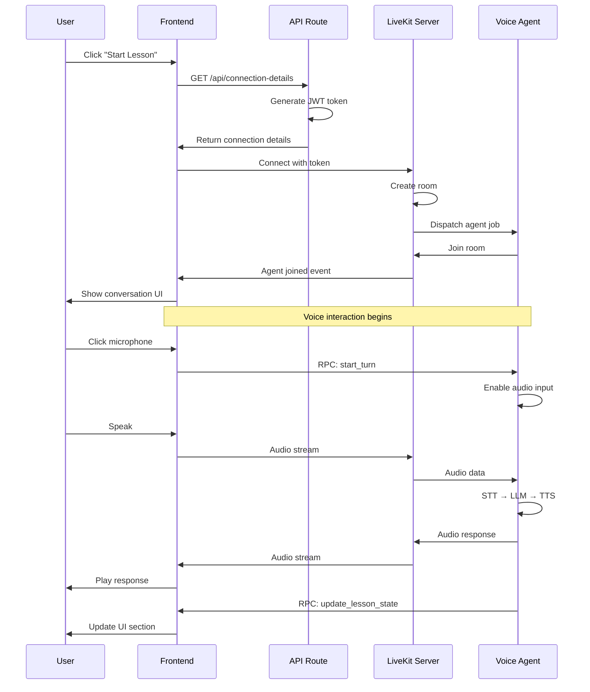
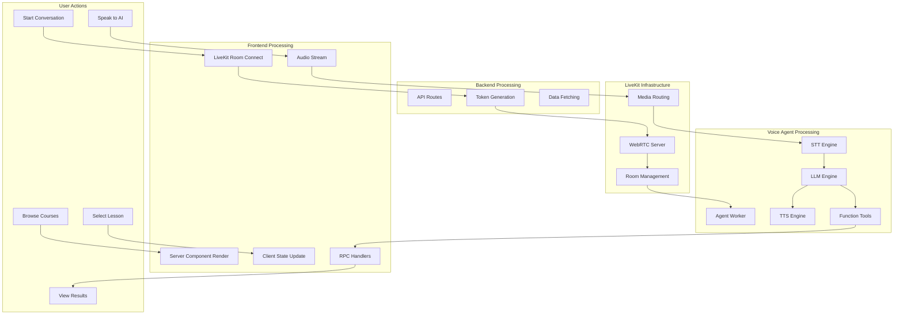

# AI-in-Education Platform - Level 4: Complete Implementation Guide

## Table of Contents

1. [Environment Setup](#environment-setup)
2. [Frontend Implementation](#frontend-implementation)
3. [Voice Agent Implementation](#voice-agent-implementation)
4. [Backend Implementation](#backend-implementation)
5. [Integration Details](#integration-details)
6. [Configuration Reference](#configuration-reference)
7. [Deployment Guide](#deployment-guide)
8. [Testing & Debugging](#testing--debugging)
9. [Troubleshooting](#troubleshooting)

---

## Environment Setup

### Prerequisites

```bash
# Required versions
Node.js >= 20.x
Python >= 3.12
Docker >= 24.x
uv (Python package manager)
```

### Installation Steps

```bash
# 1. Clone repository
git clone <repository-url>
cd ai-in-education

# 2. Frontend setup
cd front-end
npm install
cd ..

# 3. Backend setup
cd backend
uv sync
cd ..

# 4. Voice agents setup
cd voice-agents
uv sync
cd ..

# 5. Environment variables
cp .env.example .env
# Edit .env with your API keys
```

### Environment Variables

```bash
# .env file contents

# LiveKit Configuration
LIVEKIT_HOST=wss://your-livekit-server.com
LIVEKIT_API_KEY=your_api_key
LIVEKIT_API_SECRET=your_api_secret

# AI Services (Voice Agent)
OPENAI_API_KEY=sk-...                    # For LLM
DEEPGRAM_API_KEY=...                     # For STT
ELEVENLABS_API_KEY=...                   # For TTS
BITHUMAN_API_SECRET=...                  # For Avatar
BITHUMAN_MODEL_PATH=/path/to/model.imx   # Avatar model

# Application
NEXT_PUBLIC_APP_URL=http://localhost:3000
```

---

## Frontend Implementation

### File Structure Deep Dive

```
front-end/
├── app/
│   ├── [locale]/
│   │   ├── (user)/
│   │   │   ├── layout.tsx           # User layout with sidebar
│   │   │   ├── page.tsx             # Home page (course catalog)
│   │   │   ├── components/
│   │   │   │   ├── app-sidebar.tsx  # Navigation sidebar
│   │   │   │   ├── header.tsx       # Page header
│   │   │   │   └── courses.tsx      # Course grid component
│   │   │   ├── lessons/
│   │   │   │   ├── layout.tsx       # Lessons layout
│   │   │   │   ├── [slug]/
│   │   │   │   │   ├── page.tsx     # Course detail
│   │   │   │   │   └── components/
│   │   │   │   │       ├── course-header.tsx
│   │   │   │   │       └── lessons.tsx
│   │   │   │   └── @lesson/         # Parallel route
│   │   │   ├── lesson/[id]/
│   │   │   │   └── page.tsx         # Lesson summary
│   │   │   ├── conversation/
│   │   │   │   └── page.tsx         # Voice conversation UI
│   │   │   ├── topic/[id]/
│   │   │   │   └── page.tsx         # Topic details
│   │   │   ├── activity/[id]/
│   │   │   │   └── page.tsx         # Activities
│   │   │   ├── result/[id]/
│   │   │   │   └── page.tsx         # Results
│   │   │   └── avatars/[id]/
│   │   │       └── page.tsx         # Avatar selection
│   │   └── layout.tsx               # Locale provider
│   ├── api/
│   │   ├── connection-details/
│   │   │   └── route.ts             # LiveKit token generation
│   │   └── change-language/
│   │       └── route.ts             # Language switching
│   ├── layout.tsx                   # Root layout
│   └── globals.css                  # Global styles
├── components/
│   ├── ui/                          # shadcn/ui components
│   │   ├── button.tsx
│   │   ├── card.tsx
│   │   ├── dialog.tsx
│   │   └── ...
│   ├── icons/                       # Custom icons
│   └── back/
│       └── button.tsx               # Back navigation
├── lib/
│   └── utils.ts                     # Utility functions (cn, etc.)
├── hooks/                           # Custom React hooks
├── store/                           # Zustand stores
├── actions/                         # Server actions
│   ├── courses.ts                   # Course data fetching
│   └── lesson.ts                    # Lesson data fetching
├── types/                           # TypeScript types
│   ├── course.ts
│   ├── lesson.ts
│   ├── topic.ts
│   ├── connection.ts
│   └── index.ts
└── enum/                            # Enums
    └── course.ts                    # Course levels
```

### Key Components Implementation

#### 1. Course Catalog (page.tsx)

```typescript
// app/[locale]/(user)/page.tsx
export default function HomePage() {
  return (
    <div>
      {/* Search header */}
      <div className="mb-8 flex flex-col gap-4">
        <h1>Choose Your Topic</h1>
        <Input placeholder="Search topics..." />
      </div>
      
      {/* Course grid with Suspense for loading */}
      <div className="grid grid-cols-1 md:grid-cols-2 lg:grid-cols-4">
        <Suspense fallback={<CoursesLoader />}>
          <Courses courses={getCourses()} />
        </Suspense>
      </div>
    </div>
  );
}
```

#### 2. LiveKit Connection (API Route)

```typescript
// app/api/connection-details/route.ts
import { AccessToken } from 'livekit-server-sdk';

export async function GET() {
  const roomName = generateRoomName();
  const participantName = generateParticipantName();
  
  const token = new AccessToken(
    process.env.LIVEKIT_API_KEY,
    process.env.LIVEKIT_API_SECRET,
    { identity: participantName }
  );
  
  token.addGrant({
    room: roomName,
    roomJoin: true,
    canPublish: true,
    canSubscribe: true,
  });
  
  return Response.json({
    serverUrl: process.env.LIVEKIT_HOST,
    roomName,
    participantName,
    accessToken: token.toJwt(),
  });
}
```

#### 3. Voice Conversation UI

```typescript
// app/[locale]/(user)/conversation/page.tsx
'use client';

import { LiveKitRoom } from '@livekit/components-react';
import { useState, useEffect } from 'react';

export default function ConversationPage() {
  const [connectionDetails, setConnectionDetails] = useState(null);
  
  useEffect(() => {
    fetch('/api/connection-details')
      .then(res => res.json())
      .then(setConnectionDetails);
  }, []);
  
  if (!connectionDetails) return <div>Loading...</div>;
  
  return (
    <LiveKitRoom
      serverUrl={connectionDetails.serverUrl}
      token={connectionDetails.accessToken}
      connect={true}
    >
      <AudioConference />
      <TranscriptionDisplay />
      <LessonStateIndicator />
    </LiveKitRoom>
  );
}
```

### State Management with Zustand

```typescript
// store/lesson-store.ts
import { create } from 'zustand';

interface LessonStore {
  currentSection: string;
  lessonActive: boolean;
  updateSection: (section: string) => void;
  endLesson: () => void;
}

export const useLessonStore = create<LessonStore>((set) => ({
  currentSection: 'Introduction',
  lessonActive: true,
  updateSection: (section) => set({ currentSection: section }),
  endLesson: () => set({ lessonActive: false }),
}));
```

### Server Actions

```typescript
// actions/courses.ts
'use server';

import { Course } from '@/types/course';
import { courses } from '@/data/courses';

export async function getCourses(): Promise<Course[]> {
  // In production, fetch from database
  return courses;
}

export async function getCourseBySlug(slug: string): Promise<Course | null> {
  const courses = await getCourses();
  return courses.find(c => c.slug === slug) || null;
}
```

```typescript
// actions/lesson.ts
'use server';

import { Lesson } from '@/types/lesson';

export async function getLessonById(id: number): Promise<Lesson | null> {
  // In production, fetch from database
  const lessons = await getAllLessons();
  return lessons.find(l => l.id === id) || null;
}
```

---

## Voice Agent Implementation

### Complete Agent Code Walkthrough

#### main.py - Agent Worker

```python
# voice-agents/main.py
import os
import json
from loguru import logger

from livekit import agents
from livekit.agents import (
    AgentSession,
    JobProcess,
    Worker,
    metrics,
    MetricsCollectedEvent,
)
from livekit.agents.voice import room_io
from livekit.plugins.silero import VAD
from livekit.plugins import bithuman
from livekit import rtc
from bithuman import AsyncBithuman

from agent import Assistant
from models import init_llm, init_stt, init_tts
from settings import get_settings
from agent import LessonState

setting = get_settings()

async def entrypoint(ctx: agents.JobContext):
    """
    Main entry point for each agent job.
    Called when a new room is created and agent needs to join.
    """
    
    # 1. Connect to LiveKit room
    await ctx.connect(auto_subscribe=agents.AutoSubscribe.AUDIO_ONLY)
    
    # 2. Parse room metadata (passed from frontend)
    metadata = json.loads(ctx.job.metadata) if ctx.job.metadata else {}
    logger.info(f"Room metadata: {metadata}")
    
    # 3. Initialize lesson state
    lesson_state = LessonState(ctx=ctx)
    
    # 4. Create agent session with AI pipeline
    session = AgentSession[LessonState](
        userdata=lesson_state,
        
        # Turn detection mode
        turn_detection='manual',  # Controlled via RPC
        
        # Interruption settings
        min_interruption_duration=0.8,  # Seconds
        allow_interruptions=True,
        
        # Endpointing delays
        min_endpointing_delay=1.2,
        max_endpointing_delay=3.0,
        
        # AI models
        stt=init_stt(),  # Speech-to-text
        llm=init_llm(),  # Language model
        tts=init_tts(),  # Text-to-speech
        vad=VAD.load(activation_threshold=0.65),  # Voice activity detection
        
        # Connection options
        conn_options=SessionConnectOptions(
            tts_conn_options=APIConnectOptions(timeout=180.0)
        )
    )
    
    # 5. Initialize Bithuman avatar (optional)
    if True:  # Enable avatar
        try:
            runtime = AsyncBithuman(
                model_path=setting.BITHUMAN_MODEL_PATH,
                api_secret=setting.BITHUMAN_API_SECRET,
                load_model=True
            )
            bithuman_avatar = bithuman.AvatarSession(
                model_path=setting.BITHUMAN_MODEL_PATH,
                api_secret=setting.BITHUMAN_API_SECRET,
                runtime=runtime,
            )
            await bithuman_avatar.start(session, room=ctx.room)
        except Exception as e:
            logger.error(f"Failed to start Bithuman avatar: {e}")
    
    # 6. Metrics collection
    @session.on("metrics_collected")
    def _on_metrics_collected(ev: MetricsCollectedEvent):
        metrics.log_metrics(ev.metrics)
    
    # 7. Configure room I/O
    input_options = room_io.RoomInputOptions(
        video_enabled=False,
        audio_num_channels=1,
    )
    
    output_options = room_io.RoomOutputOptions(
        sync_transcription=True  # Show live transcription
    )
    
    # 8. Start agent session
    await session.start(
        room=ctx.room,
        agent=Assistant(),
        room_input_options=input_options,
        room_output_options=output_options,
    )
    
    # 9. Disable audio initially (manual control)
    session.input.set_audio_enabled(False)
    
    # 10. Register RPC handlers for client communication
    @ctx.room.local_participant.register_rpc_method("start_turn")
    async def start_turn(data: rtc.RpcInvocationData):
        """Client signals to start listening"""
        session.interrupt()
        session.clear_user_turn()
        session.input.set_audio_enabled(True)
    
    @ctx.room.local_participant.register_rpc_method("end_turn")
    async def end_turn(data: rtc.RpcInvocationData):
        """Client signals to stop listening and process"""
        session.input.set_audio_enabled(False)
        session.commit_user_turn(transcript_timeout=10.0)
    
    @ctx.room.local_participant.register_rpc_method("cancel_turn")
    async def cancel_turn(data: rtc.RpcInvocationData):
        """Client cancels current turn"""
        session.input.set_audio_enabled(False)
        session.clear_user_turn()
        logger.info("cancel turn")

def compute_load(worker: Worker) -> float:
    """Calculate worker load for auto-scaling"""
    return min(len(worker.active_jobs) / 100, 1.0)

def run():
    """Start the agent worker"""
    agents.cli.run_app(
        agents.WorkerOptions(
            entrypoint_fnc=entrypoint,
            load_fnc=compute_load,
            load_threshold=0.25,
            shutdown_process_timeout=1,
            api_key=setting.LIVEKIT_API_KEY,
            api_secret=setting.LIVEKIT_API_SECRET,
            ws_url=setting.LIVEKIT_HOST
        )
    )

if __name__ == "__main__":
    run()
```

#### agent.py - Agent Logic

```python
# voice-agents/agent.py
from livekit.agents import Agent, function_tool, RunContext, JobContext
from prompt.system_v2 import system_prompt
from dataclasses import dataclass
from typing import Optional
from loguru import logger
import json

@dataclass
class LessonState:
    """
    Maintains state during lesson session.
    Passed to agent via userdata.
    """
    ctx: Optional[JobContext] = None
    type: Optional[str] = None
    value: Optional[str] = None
    
    def update_section(self, section_name: str):
        """Update current lesson section"""
        self.type = "section_change"
        self.value = section_name
        
        return {
            "type": self.type,
            "value": self.value
        }
    
    def end_section(self):
        """Mark lesson as ended"""
        self.type = "section_end"
        self.value = "true"
        
        return {
            "type": self.type,
            "value": self.value
        }

@function_tool
async def update_lession_section(
    context: RunContext[LessonState],
    section_name: str
):
    """
    Update the lesson section so students know current section.
    
    Args:
        section_name: One of ['Introduction', 'Main Activities', 'Conclusion']
    """
    logger.info(f"Updating lesson section to: {section_name}")
    
    state = context.userdata
    payload = state.update_section(section_name)
    
    room = state.ctx.room
    participant = room.remote_participants
    
    logger.info(f"Number of remote participants: {len(participant.values())}")
    
    # Get first participant (student)
    identity = None
    for k, v in participant.items():
        identity = v.identity
        break
    
    if not identity:
        logger.info("No remote participant found, cannot update lesson section")
        return
    
    # Send RPC to client
    await room.local_participant.perform_rpc(
        destination_identity=identity,
        method="client.update_lesson_state",
        payload=json.dumps(payload)
    )
    
    return "Tool called done. Do not mention this message to user. Let continue the lesson."

@function_tool
async def end_lesson_section(context: RunContext[LessonState]):
    """
    End the current lesson section or when student wants to end lesson.
    Notifies all participants that section has ended.
    """
    logger.info("Ending current lesson section")
    
    state = context.userdata
    payload = state.end_section()
    
    room = state.ctx.room
    participant = room.remote_participants
    
    for k, v in participant.items():
        identity = v.identity
        break
    
    if not identity:
        logger.info("No remote participant found, cannot end lesson section")
        return
    
    await room.local_participant.perform_rpc(
        destination_identity=identity,
        method="client.update_lesson_state",
        payload=json.dumps(payload)
    )
    
    return "Tool called done. Do not mention this message to user. Let continue the lesson."

class Assistant(Agent):
    """
    AI English Teacher Agent.
    Uses Emma persona with structured lesson script.
    """
    
    def __init__(self):
        super().__init__(
            instructions=system_prompt,
            tools=[update_lession_section, end_lesson_section]
        )
    
    async def on_enter(self):
        """Called when agent enters the room"""
        logger.info("Assistant is entering the lesson state")
        self.session.generate_reply(
            user_input="Greeting student to the class.",
            allow_interruptions=False
        )
```

#### models.py - AI Model Initialization

```python
# voice-agents/models.py
from livekit.plugins import openai, deepgram, elevenlabs
from settings import get_settings

settings = get_settings()

def init_llm():
    """Initialize Language Model (LLM)"""
    return openai.LLM(
        model="gpt-4o",
        api_key=settings.OPENAI_API_KEY
    )

def init_stt():
    """Initialize Speech-to-Text (STT)"""
    return deepgram.STT(
        model="nova-2",
        language="en",
        api_key=settings.DEEPGRAM_API_KEY
    )

def init_tts():
    """Initialize Text-to-Speech (TTS)"""
    return elevenlabs.TTS(
        model="eleven_multilingual_v2",
        voice="Emma",  # AI teacher voice
        api_key=settings.ELEVENLABS_API_KEY
    )
```

#### settings.py - Configuration

```python
# voice-agents/settings.py
from pydantic_settings import BaseSettings

class Settings(BaseSettings):
    # LiveKit
    LIVEKIT_HOST: str
    LIVEKIT_API_KEY: str
    LIVEKIT_API_SECRET: str
    
    # AI Services
    OPENAI_API_KEY: str
    DEEPGRAM_API_KEY: str
    ELEVENLABS_API_KEY: str
    
    # Avatar
    BITHUMAN_API_SECRET: str
    BITHUMAN_MODEL_PATH: str
    
    class Config:
        env_file = ".env"
        env_file_encoding = "utf-8"

def get_settings() -> Settings:
    return Settings()
```

#### prompt/system_v2.py - Agent Prompt

```python
# voice-agents/prompt/system_v2.py
system_prompt = """
You are Emma, an experienced English teacher conducting a 1-on-1 English-speaking lesson. 
The script below shows a structured conversation between you and the student. 
Follow exactly the script to finish this lesson demonstration.

Tools:
- Use the `update_lession_section` tool to update the lesson section when student completes a section
- Use the `end_lesson_section` tool to notify when lesson section ends or when student wants to end

Lesson Script:

1. Quick Greeting -> use `update_lession_section` tool with section_name = "Greeting"
   Teacher: Hi Candies, how's your day going?
   Student: Pretty good, thank you. How about you?
   Teacher: I'm doing well too. Are you ready for today's speaking practice?
   Student: Yes, I'm ready.

2. Topic Introduction -> use `update_lession_section` tool with section_name = "Topic Introduction"
   Teacher: Great. Today, our topic is the environment. What comes to your mind when you hear "environment"?
   [... full script continues ...]

3. Main Question -> use `update_lession_section` tool with section_name = "Main Question"
   [... full script continues ...]

4. Follow-up Questions -> use `update_lession_section` tool with section_name = "Follow-up Questions"
   [... full script continues ...]
"""
```

---

## Backend Implementation

### FastAPI Application Structure

```python
# backend/main.py
from fastapi import FastAPI
from fastapi.middleware.cors import CORSMiddleware
import uvicorn

app = FastAPI(
    title="AI-In-Education API",
    description="Backend API for AI-powered English learning platform",
    version="1.0.0"
)

# CORS Configuration
app.add_middleware(
    CORSMiddleware,
    allow_origins=[
        "http://localhost:3000",
        "https://your-domain.com"
    ],
    allow_credentials=True,
    allow_methods=["*"],
    allow_headers=["*"],
)

@app.get("/")
async def root():
    """Health check endpoint"""
    return {
        "message": "Ready",
        "status": "healthy"
    }

@app.get("/health")
async def health_check():
    """Detailed health check"""
    return {
        "status": "healthy",
        "service": "backend"
    }

# Future routes will be added here
# from routes import courses, lessons, users
# app.include_router(courses.router)
# app.include_router(lessons.router)
# app.include_router(users.router)

if __name__ == "__main__":
    uvicorn.run(
        "main:app",
        host="0.0.0.0",
        port=8080,
        reload=True,
        log_level="info"
    )
```

### Future Route Structure

```python
# backend/routes/courses.py (Future)
from fastapi import APIRouter, HTTPException
from typing import List
from models import Course

router = APIRouter(prefix="/courses", tags=["courses"])

@router.get("/", response_model=List[Course])
async def get_courses():
    """Get all courses"""
    pass

@router.get("/{course_slug}", response_model=Course)
async def get_course(course_slug: str):
    """Get course by slug"""
    pass
```

---

## Integration Details

### Frontend ↔ LiveKit Integration



### Complete Data Flow



---

## Configuration Reference

### Docker Compose Configuration

```yaml
# docker-compose.yaml
version: '3.8'

services:
  backend:
    container_name: aie-backend
    restart: always
    platform: linux/arm64
    ports:
      - 8080:8080
    build:
      dockerfile: Dockerfile
      context: ./backend
    networks:
      - aie-network
    environment:
      - PYTHONUNBUFFERED=1

  voice-agents:
    container_name: aie-voice-agent
    restart: always
    platform: linux/arm64
    env_file:
      - .env
    build:
      dockerfile: Dockerfile
      context: ./voice-agents
    networks:
      - aie-network
    depends_on:
      - livekit-server

  livekit-server:
    container_name: aie-livekit-server
    image: livekit/livekit-server:latest
    env_file:
      - .env
    ports:
      - "127.0.0.1:7880:7880"  # HTTP
      - "127.0.0.1:7881:7881"  # WebSocket
      - "127.0.0.1:7882:7882/udp"  # UDP media
    command: >
      --dev --bind 0.0.0.0
      --keys "${LIVEKIT_API_KEY}: ${LIVEKIT_API_SECRET}"
    volumes:
      - livekit-data:/data
    networks:
      - aie-network
    restart: unless-stopped

networks:
  aie-network:
    driver: bridge

volumes:
  livekit-data:
```

### Next.js Configuration

```javascript
// next.config.ts
import type { NextConfig } from 'next';

const nextConfig: NextConfig = {
  // Enable experimental features
  experimental: {
    turbo: {
      enabled: true,
    },
  },
  
  // Internationalization
  i18n: {
    locales: ['en', 'vi'],
    defaultLocale: 'en',
  },
  
  // Environment variables exposed to browser
  env: {
    NEXT_PUBLIC_APP_URL: process.env.NEXT_PUBLIC_APP_URL,
  },
};

export default nextConfig;
```

---

## Deployment Guide

### Development Deployment

```bash
# 1. Start infrastructure services
docker compose up livekit-server -d

# 2. Start backend
cd backend
uvicorn main:app --reload --port 8080

# 3. Start voice agent (in separate terminal)
cd voice-agents
python main.py

# 4. Start frontend (in separate terminal)
cd front-end
npm run dev
```

### Production Deployment

#### Option 1: Docker Compose

```bash
# Build and start all services
docker compose up --build -d

# Check logs
docker compose logs -f

# Scale voice agents
docker compose up --scale voice-agents=3 -d
```

#### Option 2: Kubernetes (Future)

```yaml
# k8s/voice-agent-deployment.yaml
apiVersion: apps/v1
kind: Deployment
metadata:
  name: voice-agent
spec:
  replicas: 3
  selector:
    matchLabels:
      app: voice-agent
  template:
    metadata:
      labels:
        app: voice-agent
    spec:
      containers:
      - name: voice-agent
        image: ai-education/voice-agent:latest
        envFrom:
        - secretRef:
            name: ai-education-secrets
```

### Environment-Specific Configuration

**Development**:
```bash
LIVEKIT_HOST=ws://localhost:7880
NEXT_PUBLIC_APP_URL=http://localhost:3000
```

**Production**:
```bash
LIVEKIT_HOST=wss://livekit.yourdomain.com
NEXT_PUBLIC_APP_URL=https://yourdomain.com
```

---

## Testing & Debugging

### Frontend Testing

```bash
# Type checking
cd front-end
npm run lint

# Build test
npm run build

# Manual testing
npm run dev
# Visit http://localhost:3000
```

### Voice Agent Testing

```bash
# Test agent worker
cd voice-agents
python main.py

# Check logs
tail -f logs/agent.log

# Test LiveKit connection
lk-cli join-room --url ws://localhost:7880 \
  --api-key $LIVEKIT_API_KEY \
  --api-secret $LIVEKIT_API_SECRET
```

### Integration Testing

```bash
# 1. Start all services
docker compose up -d

# 2. Check service health
curl http://localhost:8080/health
curl http://localhost:7880

# 3. Test frontend
curl http://localhost:3000

# 4. Monitor logs
docker compose logs -f voice-agents
```

### Debugging Tips

**Frontend Issues**:
```bash
# Check browser console
# Check Network tab for API calls
# Use React DevTools
```

**Voice Agent Issues**:
```bash
# Enable debug logging
export LOG_LEVEL=DEBUG
python main.py

# Check LiveKit room
lk-cli list-rooms --url ws://localhost:7880
```

**LiveKit Issues**:
```bash
# Check LiveKit logs
docker logs aie-livekit-server

# Test WebSocket connection
wscat -c ws://localhost:7880
```

---

## Troubleshooting

### Common Issues

#### 1. LiveKit Connection Failed

**Symptoms**: Frontend can't connect to LiveKit room

**Solutions**:
```bash
# Check LiveKit server is running
docker ps | grep livekit

# Check ports
lsof -i :7880
lsof -i :7881

# Verify API keys
echo $LIVEKIT_API_KEY
echo $LIVEKIT_API_SECRET

# Check token generation
node -e "console.log(new (require('livekit-server-sdk').AccessToken)('key', 'secret', {identity: 'test'}).toJwt())"
```

#### 2. Voice Agent Not Responding

**Symptoms**: Agent joins room but doesn't speak

**Solutions**:
```bash
# Check agent logs
docker compose logs voice-agents

# Verify AI service API keys
echo $OPENAI_API_KEY
echo $DEEPGRAM_API_KEY
echo $ELEVENLABS_API_KEY

# Test STT
curl -X POST "https://api.deepgram.com/v1/listen" \
  -H "Authorization: Token $DEEPGRAM_API_KEY"

# Test LLM
curl https://api.openai.com/v1/chat/completions \
  -H "Authorization: Bearer $OPENAI_API_KEY"
```

#### 3. CORS Errors

**Symptoms**: Browser blocks API requests

**Solutions**:
```python
# backend/main.py - Update CORS settings
app.add_middleware(
    CORSMiddleware,
    allow_origins=["http://localhost:3000"],  # Add your domain
    allow_credentials=True,
    allow_methods=["*"],
    allow_headers=["*"],
)
```

#### 4. Audio Quality Issues

**Symptoms**: Choppy or delayed audio

**Solutions**:
```python
# Adjust buffer sizes in voice-agents/main.py
conn_options=SessionConnectOptions(
    tts_conn_options=APIConnectOptions(
        timeout=180.0  # Increase if TTS is slow
    )
)

# Adjust VAD threshold
vad=VAD.load(activation_threshold=0.75)  # Increase for less sensitivity
```

#### 5. Avatar Not Loading

**Symptoms**: Bithuman avatar fails to start

**Solutions**:
```bash
# Check model path exists
ls -la $BITHUMAN_MODEL_PATH

# Verify API secret
echo $BITHUMAN_API_SECRET

# Check Bithuman service status
curl -H "Authorization: Bearer $BITHUMAN_API_SECRET" \
  https://api.bithuman.io/status
```

### Performance Optimization

**Frontend**:
```typescript
// Use dynamic imports for heavy components
const LiveKitRoom = dynamic(
  () => import('@livekit/components-react').then(mod => mod.LiveKitRoom),
  { ssr: false }
);

// Memoize expensive computations
const memoizedCourses = useMemo(() => courses, [courses]);
```

**Voice Agent**:
```python
# Use connection pooling
llm = openai.LLM(
    model="gpt-4o",
    api_key=settings.OPENAI_API_KEY,
    timeout=30.0  # Set reasonable timeout
)

# Optimize VAD
vad = VAD.load(
    activation_threshold=0.65,
    debounce_time=0.5  # Reduce false triggers
)
```

### Monitoring

**Health Checks**:
```bash
# Backend
curl http://localhost:8080/health

# LiveKit
curl http://localhost:7880

# Voice agent (custom endpoint)
curl http://localhost:8081/metrics
```

**Logs**:
```bash
# All services
docker compose logs -f

# Specific service
docker compose logs -f voice-agents | grep ERROR

# Export logs
docker compose logs > debug.log
```

---

## Summary

This comprehensive guide covers:

- **Environment Setup**: Prerequisites and installation
- **Frontend**: Complete Next.js 15 implementation
- **Voice Agent**: LiveKit agents with STT/LLM/TTS pipeline
- **Backend**: FastAPI structure and future expansion
- **Integration**: End-to-end data flow
- **Configuration**: Docker, environment variables
- **Deployment**: Development and production strategies
- **Testing**: Debugging and troubleshooting

For additional support, refer to:
- [Next.js Documentation](https://nextjs.org/docs)
- [LiveKit Documentation](https://docs.livekit.io)
- [FastAPI Documentation](https://fastapi.tiangolo.com)
- Project README.md
